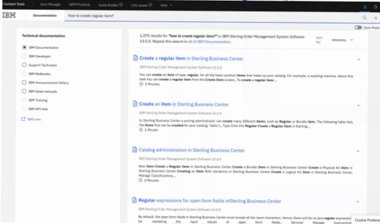

# OMS-Knowledge-Assistant-watsonx.ai
# Enhance the search experience in IBM Sterling Order Management System Knowledge center using the Retrieval-Augmented Generation (RAG) approach with watsonx.ai and Chroma DB

IBM Sterling OMS (Order Management System) is a powerful platform that offers comprehensive visibility, allowing businesses to oversee inventory, monitor orders in real time, and enhance customer experiences through efficient and adaptable order processing. Its features, including AI-driven insights and smooth integration with current systems, enable organizations to respond to shifting market demands and boost operational efficiency.

When a developer in supply chain management seeks to configure IBM Sterling OMS, they often navigate the Knowledge Center in search of guidance. However, they may feel overwhelmed by the abundance of links and information, making it challenging to pinpoint the solution to their specific question.Utilizing the asset helps refine the search results, making them more accurate and precise.

This tutorial details on how to leverage the Retrieval-Augmented Generation (RAG) approach with Watson X AI and Chroma DB to enhance the experience for developers using Sterling OMS search capabilities in Knowledge center.

# Pre-reqs
1.  Install python 3.10 environment and Visual code editor.
2.  Check in the Mainsource.py
3.  Please provide the api key and watsonx project id details from ibm.cloud.com
4.  Importing the pre-requisite libraries which are associated with the Mainsource.py
5.  Execute the Mainsource.py

# Watsonx Configurations
Provide the api key, Watsonx Project id , model id and endpoint url as shown below 

The Prompt lab parameters are provided as below and the prompt instruction is given as below .

The query passed via UI is stored and sent to the prompt lab with the code below 

# Website Crawling
OMS knowledge center link is provided as below .

The website provided is crawled and data is chunked and inserted to Chroma db 

# Asset Execution

When the question "how to create a regular item" is asked via Knowledge center link , multiple search results come up as shown below

Open the HTML_UI.html .The same question is asked via OMS Knowledge Assistant the answer is accurate and precise as shown.

# References

https://www.ibm.com/docs/en/order-management-sw/10.0

# Acknowledgments
Thanks to Yukti Makkar,Mansi Tewari,Kishan Dhongadi,Vikas Agrawal and Aditi Shah for their invaluable assistance .

